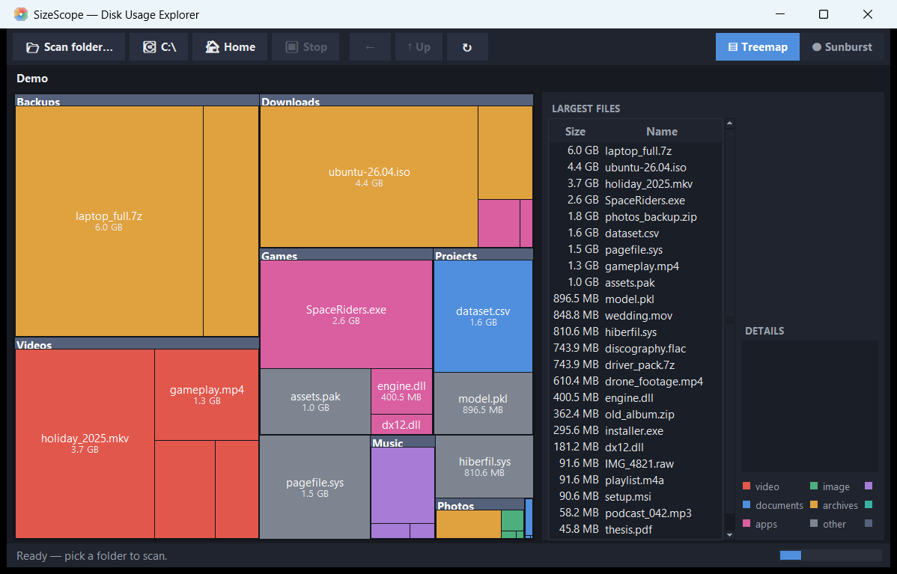
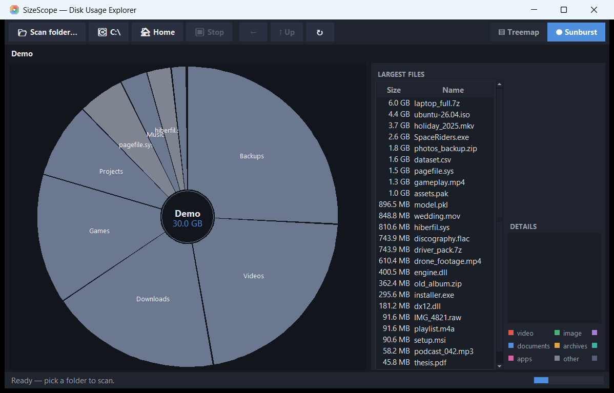

# SizeScope 🔍

**See what's eating your disk — visually.**

SizeScope is a free, open-source disk-usage explorer for Windows that turns files
and folders into graphics, inspired by Apple's DaisyDisk / GrandPerspective
(the classic "file size" visualizers).

| Treemap view | Sunburst view |
|:---:|:---:|
|  |  |

- **Treemap** — every file is a rectangle; the bigger the file, the bigger the
  rectangle (WinDirStat style)
- **Sunburst** — concentric rings around the current folder; the DaisyDisk look

## Features

- 🚀 **Fast background scanning** with live progress — scan any folder or a
  whole drive; stop anytime with `Esc`
- 🎨 **Color-coded by file type** — video, images, audio, documents, archives,
  code, apps (legend built in)
- 🖱️ **Click to explore** — single-click a folder to zoom into it; hover
  anything for its path, size and share
- 📌 **Locate big files** — click a row in *Largest Files* and SizeScope jumps
  to the folder containing it and outlines it in yellow
- 📋 **Top-25 files list**, details panel, breadcrumb navigation, back/up history
- 🧭 **Safe by design** — reveal in Explorer / copy path only; no deleting
- 🪶 **Zero dependencies** — pure Python + tkinter, and a single portable `.exe`
  with Python embedded

## Download

Get the latest **`SizeScope.exe`** from the
[Releases page](https://github.com/crxdnl-cell/sizescope/releases/latest) —
one file, ~9 MB, no installation. Works on Windows 10/11 (64-bit).

> - **First launch takes a few seconds** — a one-file exe unpacks itself first. Normal.
> - **SmartScreen may warn** because the exe is unsigned:
>   *More info → Run anyway*. If you prefer, run from source (below) — it's all
>   readable Python.

### Run from source

Any Python 3.8+ with tkinter (included in the standard Windows installer):

```
python sizescope.py
```
or double-click `SizeScope.bat`.

## How to use

| Action | How |
|---|---|
| Scan a folder | **📂 Scan folder…**, or the quick buttons **C:\\** / **🏠 Home** |
| See details | Hover any rectangle / ring segment |
| Pin details | Click a **file** (click again to unpin) |
| **Zoom into a folder** | **Single-click it** in the treemap or sunburst |
| Find a big file | Click a row in **Largest Files** → jumps to its folder + yellow outline |
| Open a file's location | Right-click → *Reveal in Explorer* (or double-click a file) |
| Go up / back | **↑ Up** / `Backspace`; **←** / breadcrumb to navigate |
| Switch view | **▤ Treemap / ◍ Sunburst** toggle, top-right |
| Stop a scan | **⏹ Stop** or `Esc` |
| Re-scan current folder | **↻** |

### Good to know

- Sizes are **logical bytes** (what File Explorer shows), not physical disk usage.
- Junctions and symlinks (e.g. `C:\Users\All Users`) are skipped, so nothing is
  double-counted and scanning can't loop.
- "Unreadable items" in the status bar counts system folders Windows won't let
  the app read.
- A full `C:\` scan can take a few minutes (millions of entries); progress is live.

## How it works

```
Scanner (thread) ──queue──► App ──► TreemapView (squarified treemap)
  os.scandir walk               ├──► SunburstView (ring segments)
  sizes aggregated bottom-up    └──► Largest-files list / details
  junctions & reparse skipped
```

- **Squarified treemap** layout ([Bruls, Huizing & van Wijk,
  2000](https://www.win.tue.nl/~vanwijk/stm.pdf)) keeps rectangles close to
  square for readability.
- **Sunburst** renders up to 5 rings; segments narrower than ~1.2° are merged
  into a single *"N small items"* wedge so nothing is silently invisible.
- The scanner aggregates folder sizes bottom-up in a background thread and
  reports progress through a queue — the UI never blocks.

## Development

```bash
python sizescope.py --selftest     # 42 checks: layout math, scanner, GUI smoke
python make_icon.py                # regenerate sizescope.ico (pure stdlib)
python screenshot.py               # regenerate docs/screenshot-*.png
python -m venv .venv-build && .venv-build/Scripts/pip install pyinstaller
.venv-build/Scripts/python.exe -m PyInstaller --onefile --windowed --name SizeScope ^
    --icon sizescope.ico --distpath dist --workpath build --specpath build sizescope.py
```

See [CONTRIBUTING.md](CONTRIBUTING.md) for details,
[CHANGELOG.md](CHANGELOG.md) for release history.

### Project structure

```
sizescope.py     the whole app (scanner, treemap, sunburst, GUI) — one file
make_icon.py     generates the multi-size .ico (no external tools)
screenshot.py    captures README screenshots from the live app
docs/            screenshots
```

## Acknowledgments

- Treemap layout: *"Squarified Treemaps"* by Bruls, Huizing & van Wijk.
- Design inspiration: [DaisyDisk](https://daisydiskapp.com),
  [WinDirStat](https://windirstat.net), [GrandPerspective](https://grandperspectiv.sourceforge.net).

## License

[MIT](LICENSE) © 2026 crxdnl-cell
